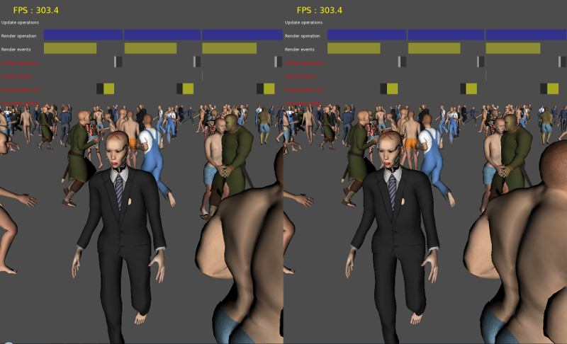
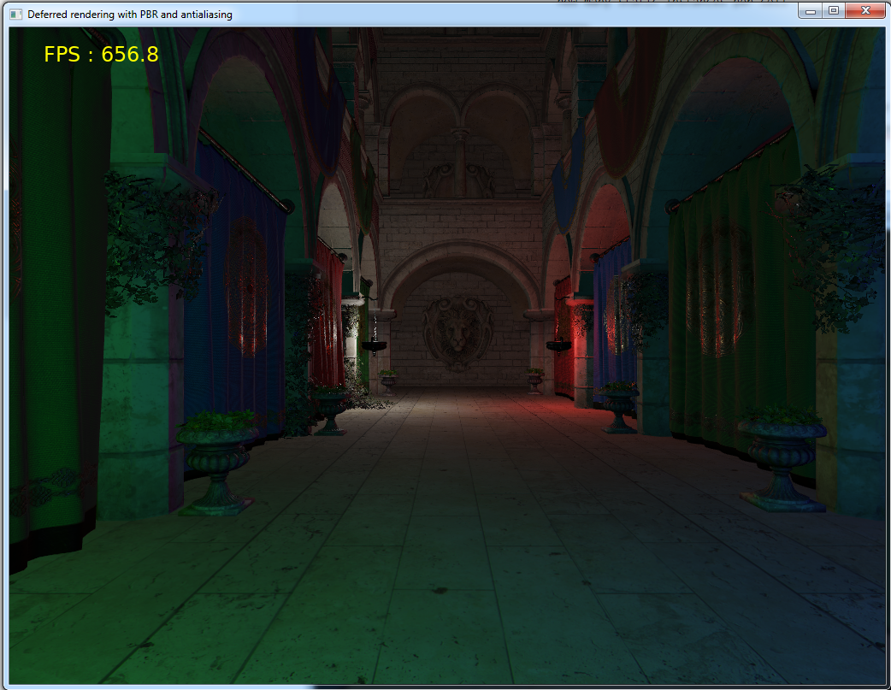

# Pumex library

The purpose of the **Pumex** library is to create an efficient rendering engine using **Vulkan API** that has following properties :

- enables multithreaded rendering on many windows ( or many screens ) at once
- may render to many graphics cards in a single application
- decouples rendering phase from update phase and enables update step with constant time rate independent from rendering time rate
- uses modern C++ ( C++11 and C++14 ) but not overuses its features if it's not necessary
- works on many platforms ( at the moment Pumex supports rendering on Windows and Linux )
- implements efficient rendering algorithms ( like instanced rendering with vkCmdDrawIndexedIndirect() to draw many objects of different types with one draw call )


## Instalation on Windows

Elements that are required to install Pumex on Windows :

- [Vulkan SDK](https://vulkan.lunarg.com/)
- [CMake](https://cmake.org/) **version at least 3.7.0** ( earlier versions do not have FindVulkan.cmake module)
- [git](https://git-scm.com/)
- Microsoft Visual Studio 2013 ( 64 bit ) or Microsoft Visual Studio 2015 ( 64 bit )

Steps needed to build a library :

1. download Pumex Library from [here](https://github.com/pumexx/pumex)

2. create solution files for MS Visual Studio using CMake

3. build Release version for 64 bit. All external dependencies will be downloaded during first build

4. if example programs have problem with opening shader files, or 3D models - set the **PUMEX_DATA_DIR** environment variable so that it points to a directory with data files, for example :

   ```set PUMEX_DATA_DIR=C:\Dev\pumex\data```

   ​

## Installation on Linux

Elements that are required to install Pumex on Windows :

- [Vulkan SDK](https://vulkan.lunarg.com/)
- [CMake](https://cmake.org/) **version at least 3.7.0** ( earlier versions do not have FindVulkan.cmake module)
- [git](https://git-scm.com/)
- gcc compiler
- following libraries
  - [Assimp](https://github.com/assimp/assimp)
  - [Intel Threading Building Blocks](https://www.threadingbuildingblocks.org/)
  - [Fretype2](https://www.freetype.org/)

You can install above mentioned libraries using this command :

```sudo apt-get install libassimp-dev libtbb-dev libfreetype6-dev```

Other libraries will be downloaded during first build ( [glm](http://glm.g-truc.net), [gli](http://gli.g-truc.net) and [args](https://github.com/Taywee/args) )

Steps needed to build a library :

1. download Pumex Library from [here](https://github.com/pumexx/pumex)

2. create solution files for gcc using CMake, choose "Release" configuration type for maximum performance 

3. perform make

4. if example programs have problem with opening shader files, or 3D models - set the **PUMEX_DATA_DIR** environment variable so that it points to a directory with data files, for example :

   ```export PUMEX_DATA_DIR=${HOME}/Dev/pumex/data```

## Pumex examples

There are four example programs in Pumex right now :

### pumexcrowd

Application that renders a crowd of 500 animated people on one or more windows


- There are 3 different models of human body, each one has 3 LODs ( levels of detail ) :
  - LOD0 has 26756 triangles
  - LOD1 has 3140 triangles
  - LOD2 has 1460 triangles
- Skeleton of each model has 53 bones
- Each body has 3 texture variants
- Each model has 3 different sets of clothes ( also 3D models ). Each cloth has only 1 LOD.

Command line parameters enable us to use one of predefined window configurations :

```
      -h, --help                        display this help menu
      -d                                enable Vulkan debugging
      -f                                create fullscreen window
      -v                                create two halfscreen windows for VR
      -t                                render in three windows
```

While application is running, you are able to use following keys :

- W, S, A, D - move camera : forward, backward, left, right
- Q, Z - move camera up, down
- Left Shift - move camera faster
- T - hide / show time statistics

Camera rotation may be done by moving a mouse while holding a left mouse button.

Below is additional image showing pumexcrowd example working in VR mode ( 2 windows - each one covers half of the screen, window decorations disabled ) :



### pumexgpucull

 Application that renders simple not textured static objects ( trees, buildings ) and dynamic objects ( cars, airplanes, blimps ) on one or more windows. This application serves as performance test, because all main parameters may be modified ( LOD ranges, number of objects, triangle count on each mesh ). All meshes are generated procedurally. Each LOD for each mesh has different color, so you may see, when it switches betwen LODs. In OpeneSceneGraph library there is almost the same application called osggpucull, so you may compare performance of Vulkan API and OpenGL API.


Command line parameters enable us to use one of predefined window configurations and also we are able to modify all parameters that affect performance :

```
  -h, --help                        display this help menu
  -d                                enable Vulkan debugging
  -f                                create fullscreen window
  -v                                create two halfscreen windows for VR
  -t                                render in three windows
  --skip-static                     skip rendering of static objects
  --skip-dynamic                    skip rendering of dynamic objects
  --static-area-size=[static-area-size]
                                    size of the area for static rendering
  --dynamic-area-size=[dynamic-area-size]
                                    size of the area for dynamic rendering
  --lod-modifier=[lod-modifier]     LOD range [%]
  --density-modifier=[density-modifier]
                                    instance density [%]
  --triangle-modifier=[triangle-modifier]
                                    instance triangle quantity [%]
```

While application is running, you are able to use following keys :

- W, S, A, D - move camera : forward, backward, left, right
- Q, Z - move camera up, down
- Left Shift - move camera faster
- T - hide / show time statistics

Camera rotation may be done by moving a mouse while holding a left mouse button.


### pumexdeferred

Application that makes deferred rendering with multisampling in one window. Famous Sponza Palace model is used as a render scene.



Available command line parameters :

```
  -h, --help                        display this help menu
  -d                                enable Vulkan debugging
  -f                                create fullscreen window
```

While application is running, you are able to use following keys :

- W, S, A, D - move camera : forward, backward, left, right
- Q, Z - move camera up, down
- Left Shift - move camera faster

Camera rotation may be done by moving a mouse while holding a left mouse button.


### pumexviewer

Minimal pumex application that renders single not textured 3D model provided by the user in command line. Models that may be read by Assimp library are able to render in that application.


Available command line parameters :

```
  -h, --help                        display this help menu
  -d                                enable Vulkan debugging
  -f                                create fullscreen window
  -m[model]                         3D model filename
```

While application is running, you are able to use following keys :

- W, S, A, D - move camera : forward, backward, left, right

Camera rotation may be done by moving a mouse while holding a left mouse button.


**Remark** : Pumex is a "work in progress" which means that some elements are not implemented yet ( like push constants for example ) and some may not work properly on every combination of hardware / operating system. At the moment I also have only one monitor on my PC, so I am unable to test Pumex on multiple screens (multiple windows on one screen work like a charm , though ). Moreover I haven't tested Pumex on any AMD graphics card for the same reason. Pumex API is subject to change.

